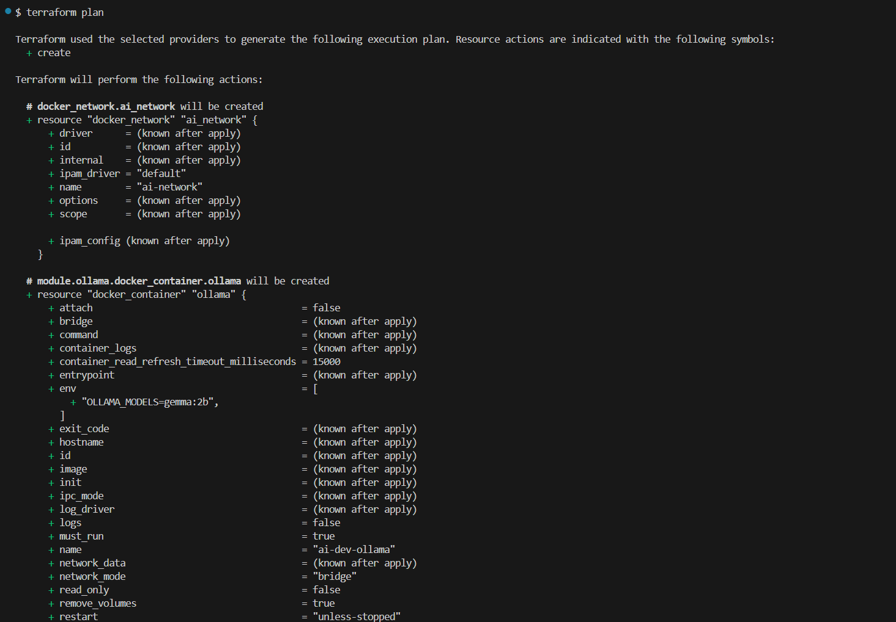
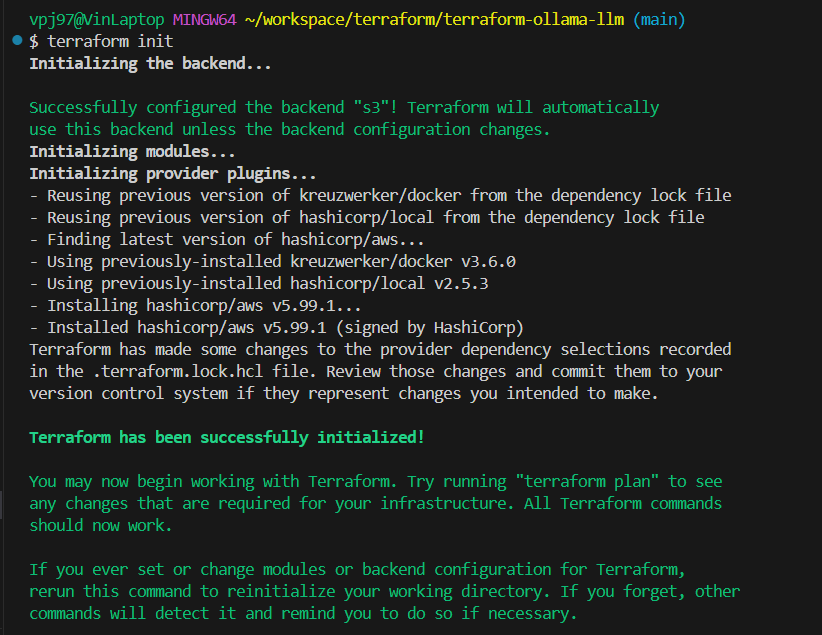

# Terraform Ollama LLM Environment

## Projektbeschreibung

Dieses Terraform-Projekt stellt eine lokale LLM-Entwicklungsumgebung bereit, bestehend aus zwei zentralen Services:

- **Ollama**: LLM-Inferenzserver zur Nutzung und Verwaltung lokal gespeicherter Sprachmodelle
- **Open WebUI**: Benutzerfreundliche Oberfläche zur Interaktion mit Ollama-Modellen im Browser

Die Infrastruktur wird vollständig mit Terraform verwaltet und umfasst Container, Netzwerk, optional persistente Volumes und modulare Konfiguration.

## Terraform AWS S3 Research

Diese Aufgabe befindet sich im Unterverzeichnis [`aws-s3-research/`](aws-s3-research/).

Inhalte:
- Nutzung des AWS Providers
- Erstellung eines S3 Buckets via Terraform
- Dokumentation, Screenshots und Beispielkonfiguration


## Ziel und Motivation

Ziel war es, einen **nicht-trivialen Infrastructure-as-Code-Anwendungsfall** umzusetzen, der mehrere Ressourcen, Parameterisierung, Wiederverwendbarkeit und den vollständigen Terraform-Workflow abbildet.

Terraform eignet sich hier besonders gut, da:
- das Setup regelmäßig neu provisioniert oder verändert wird
- Infrastruktur leicht versioniert und angepasst werden kann
- Volumes, Netzwerk und Services im lokalen Docker-Ökosystem zuverlässig und deklarativ verwaltet werden

## Komponenten & Struktur

```
terraform-ollama-llm/
├── main.tf                # Root-Konfiguration
├── variables.tf           # Alle Eingabevariablen
├── outputs.tf             # Wichtige Ausgaben
├── provider.tf            # Docker Provider
├── locals.tf              # Lokale berechnete Werte
├── modules/
│   ├── ollama_service/    # Modul für Ollama
│   └── openwebui/         # Modul für WebUI
└── screenshots/           # Nachweis der Ausführung
```

## Ressourcen im Projekt

### Root-Level Ressourcen
- **docker_network.ai_network**: Gemeinsames Docker-Netzwerk für alle Services

### Modul ollama_service
- docker_image.ollama
- docker_container.ollama
- docker_volume.ollama_models (optional, je nach Einstellung)

### Modul openwebui
- docker_image.webui
- docker_container.webui

## Genutzte Terraform-Konzepte

| Konzept | Erklärung |
|---------|-----------|
| Provider | kreuzwerker/docker für lokale Containerverwaltung |
| Ressourcen | Container, Images, Netzwerk, Volumes |
| Module | ollama_service, openwebui (lokal) |
| Variables | z. B. Modellwahl, Ports, Präfix, Persistenz |
| Locals | Automatisierte Namensbildung |
| Outputs | Endpunkte von Ollama und WebUI |

## Ausführungsschritte

```bash
terraform init
terraform validate
terraform plan
terraform apply
```

### Optionaler Test der Persistenz

```bash
docker exec -it ai-dev-ollama ollama pull gemma:2b
docker exec -it ai-dev-ollama ollama run gemma:2b "Was ist Terraform?"
docker exec -it ai-dev-ollama ollama list
```

## Screenshots

Die folgenden Screenshots dokumentieren die erfolgreiche Ausführung:

### Terraform Init


### Terraform Plan (Schritt 1-4)



### Terraform Apply


### Open WebUI Interface


## Remote State Konfiguration (AWS S3)

Zur Verwaltung des Terraform-Zustands wurde ein Remote Backend auf AWS S3 eingerichtet, um Teamarbeit zu ermöglichen und lokale Datenverluste zu vermeiden.

### Vorteile

- Zentrale Speicherung des State-Files
- Verbesserte Teamfähigkeit (Shared Infrastructure-as-Code)
- Sicherheit durch S3-Versionierung und optionaler Verschlüsselung

### Konfiguration (backend.tf)

```hcl
terraform {
  backend "s3" {
    bucket = "terraform-ollama-state-vin"
    key    = "ollama-project.tfstate"
    region = "eu-central-1"
  }
}
```

### Migration und Initialisierung

Nach dem Hinzufügen des backend Blocks wurde `terraform init` ausgeführt. Terraform erkannte den vorhandenen lokalen State und bot an, diesen ins Remote Backend zu migrieren. Die Migration wurde bestätigt und erfolgreich abgeschlossen.

### Validierung des Remote State

- Die Datei `ollama-project.tfstate` ist im S3-Bucket `terraform-ollama-state-vin` sichtbar
- Die Ausführung von `terraform state list` listet die Ressourcen korrekt aus dem Remote Backend auf
- Der lokale State (`terraform.tfstate`) wurde durch einen kleinen Verweis ersetzt und verbleibt nicht mehr als vollständige Datei im Verzeichnis

### Screenshots Remote State

#### S3 Bucket mit State-Datei


#### Terraform Init mit Remote State


#### State List Ausgabe


## Bekannte Probleme und Offene Punkte

### Modell-Persistenz
**Status:** Noch nicht funktionsfähig

Die Persistierung der heruntergeladenen Language Models funktioniert aktuell noch nicht wie erwartet. Obwohl ein Docker Volume (`ai-dev-models`) korrekt eingebunden ist und im Container an `/root/.ollama` gemountet wird, sind die Modelle nach einem Neustart oder einer Neuerstellung des Containers nicht mehr verfügbar.

**Vermutung:** Möglicherweise speichert Ollama die Models an einem anderen Pfad oder benötigt explizite Parameter für persistente Speicherung.

**Nächste Schritte:**
- Volume-Pfade und Ollama-Konfiguration überprüfen
- Alternative Persistierung-Strategien evaluieren
- Debugging der Container-Filesystem-Struktur

## Reflexion & Herausforderungen

Die größte Herausforderung war das saubere Zusammenspiel zwischen Terraform, Docker und dem Speicherort der Modelle.

**Wichtige Erkenntnisse:**
- OLLAMA_MODELS funktioniert nicht zuverlässig zur Initialisierung, daher ist ein Pull via docker exec robuster
- Das Volume-Mounting mit dynamischem Block (dynamic "mounts") war ein praktisches Terraform-Feature für optionale Konfiguration
- Die Modularisierung hat geholfen, den Code klar zu strukturieren

## Technische Details

### Netzwerk-Konfiguration
Alle Services werden in einem gemeinsamen Docker-Netzwerk betrieben, um die Kommunikation zwischen Ollama und Open WebUI zu ermöglichen.

### Persistenz
Durch die optionale Volume-Konfiguration bleiben heruntergeladene Modelle auch nach einem Container-Neustart erhalten.

### Modularität
Die Aufteilung in separate Module für Ollama und Open WebUI ermöglicht eine saubere Trennung der Verantwortlichkeiten und erleichtert die Wartung.

## Fazit

Dieses Projekt demonstriert erfolgreich den Einsatz von Terraform für die Verwaltung einer lokalen Entwicklungsumgebung mit mehreren zusammenhängenden Services. Die modulare Struktur und die Verwendung von Variablen machen das Setup flexibel und wiederverwendbar.