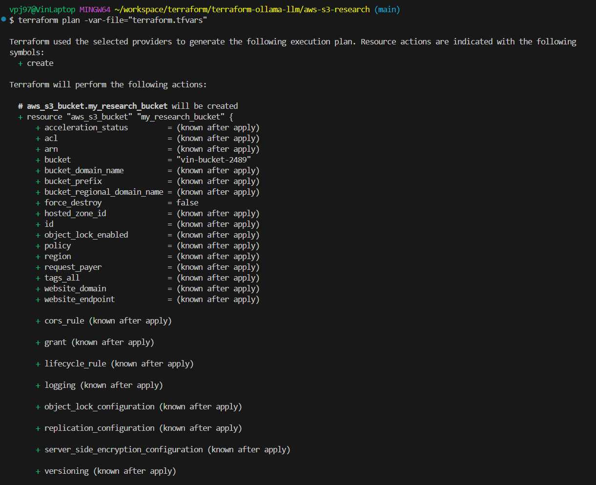

# AWS S3 Research Documentation

## 1. Die Rolle des AWS Providers: Was macht er für Terraform?

Der AWS Provider dient als Brücke zwischen Terraform und der Amazon Web Services (AWS) API. Er ermöglicht es, AWS-Ressourcen wie EC2-Instanzen, S3 Buckets oder VPCs deklarativ über Terraform zu verwalten. Sobald der Provider konfiguriert ist, kann Terraform API-Anfragen an AWS senden, um die gewünschte Infrastruktur zu erstellen, zu ändern oder zu löschen.

## 2. Konfiguration des AWS Providers

**Welche Argumente (mindestens die Region) hast du in deiner Konfiguration genutzt und warum?**

In der Konfiguration wurde folgender Provider-Block verwendet:

```hcl
provider "aws" {
  region  = "eu-central-1"
  profile = "default"
}
```

- `region` legt fest, in welcher geografischen Region AWS-Ressourcen erstellt werden (hier: Frankfurt).
- `profile` verweist auf das AWS-Profil in der Datei `~/.aws/credentials`, welches Authentifizierungsdaten wie Zugriffsschlüssel enthält.

Die Anmeldedaten selbst werden **nicht im Terraform-Code gespeichert**, sondern über die AWS CLI Konfiguration geladen. Alternativ kann auch über Umgebungsvariablen wie `AWS_ACCESS_KEY_ID` und `AWS_SECRET_ACCESS_KEY` authentifiziert werden.

## 3. Die `aws_s3_bucket` Ressource

**Beschreibe, was diese Ressource in der realen AWS-Welt repräsentiert.**

Die `aws_s3_bucket` Ressource definiert einen Amazon S3 Bucket, der zum Speichern von Objekten wie Dateien, Backups oder statischen Website-Inhalten verwendet wird. Jeder Bucket ist weltweit eindeutig benannt und kann optional mit Zugriffsregeln, Versionierung oder Tags versehen werden. Terraform ermöglicht es, diesen Bucket inklusive aller Einstellungen deklarativ zu verwalten.

## 4. Gefundene Dokumentation

**Wo hast du die Dokumentation für den AWS Provider und die `aws_s3_bucket` Ressource gefunden?**

Die Dokumentation wurde auf der offiziellen Terraform Registry gefunden:

- AWS Provider allgemein: https://registry.terraform.io/providers/hashicorp/aws/latest
- `aws_s3_bucket` Ressource: https://registry.terraform.io/providers/hashicorp/aws/latest/docs/resources/s3_bucket

**Was ist der Unterschied zwischen "Argument Reference" und "Attribute Reference" in der Dokumentation dieser Ressource?**

- **Argument Reference** listet alle Parameter auf, die in der Ressourcendefinition gesetzt werden können. Zum Beispiel: `bucket`, `acl`, `tags`.
- **Attribute Reference** beschreibt die automatisch verfügbaren Werte, nachdem die Ressource erstellt wurde. Zum Beispiel: `arn`, `id`, `bucket_domain_name`.

Diese Werte können z. B. in einem `output` Block oder als Input für andere Ressourcen genutzt werden.

## 5. Umgesetztes Beispiel

**Code der .tf Datei(en):**

```hcl
resource "aws_s3_bucket" "my_research_bucket" {
  bucket = "vin-s3-bucket-3491"
  
  tags = {
    Purpose = "Terraform Research"
  }
}

output "bucket_arn" {
  value = aws_s3_bucket.my_research_bucket.arn
}
```

**Erklärung des Output Blocks:**

Dieser Code erstellt einen S3 Bucket mit dem Namen `vin-s3-bucket-3491` und weist ihm ein Tag mit dem Zweck "Terraform Research" zu. Der `output` Block gibt die Amazon Resource Name (ARN) des Buckets aus – also einen eindeutigen Bezeichner für die Ressource innerhalb von AWS.

## 6. Screenshots der Terraform-Ausführung

### Terraform Plan (Schritt 1)


### Terraform Plan (Schritt 2) 


### Terraform Apply


### S3 Bucket in AWS Console


### Terraform Destroy
