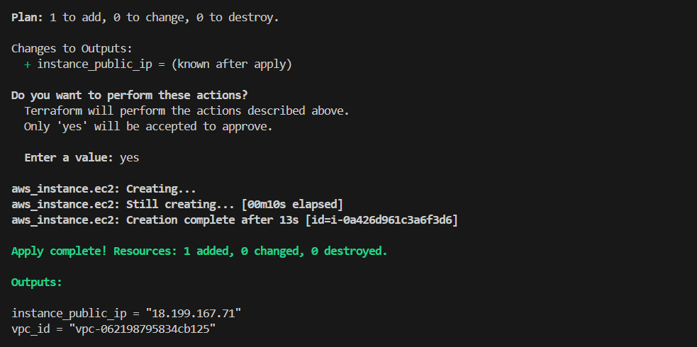
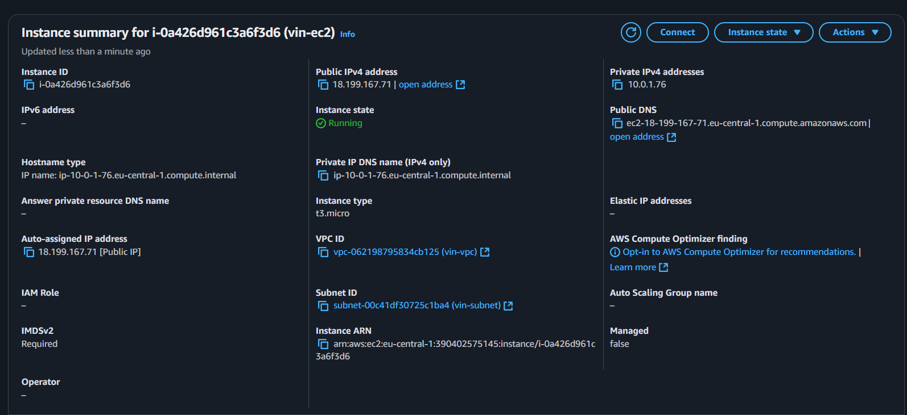

# Aufgabe: AWS VPC und EC2 Instanz mit Terraform

Dieses Projekt enthält eine Terraform-Konfiguration zur Bereitstellung folgender AWS-Ressourcen:

- Eine Virtual Private Cloud (VPC) mit dem CIDR-Block `10.0.0.0/16`
- Ein Subnetz innerhalb der VPC (`10.0.1.0/24`)
- Eine Security Group, die SSH-Zugriff (Port 22) von überall erlaubt
- Eine EC2-Instanz vom Typ `t3.micro` mit Ubuntu 24.04 LTS AMI

## Speicherort der Konfiguration

Pfad: `terraform/aws-vpc-ec2/`

Enthaltene Dateien:

- `main.tf`
- `provider.tf`
- `variables.tf`
- `outputs.tf`
- `.gitignore`
- `screenshots/` (siehe unten)

## Screenshots (Nachweise)

### 1. Terraform Init

### 2. Terraform Plan (mehrteilig)

### 3. Terraform Apply

### 4. AWS EC2-Instanz

### 5. Security Group mit SSH-Zugriff

### 6. Terraform Destroy

## Reflexion

**Welche AWS-Ressourcen (Typen) hast du in dieser Aufgabe mit Terraform erstellt?**

aws_vpc, aws_subnet, aws_security_group, aws_instance

**Beschreibe, wie du die Abhängigkeiten zwischen den Ressourcen (z. B. dass das Subnetz erst nach dem VPC erstellt wird) in deiner Terraform-Konfiguration definiert hast. Waren es implizite oder explizite Abhängigkeiten?**

Durch Referenzen (z. B. `vpc_id = aws_vpc.main.id`). Es handelt sich um implizite Abhängigkeiten.

**Was ist die Rolle der Sicherheitsgruppe in diesem Setup? Warum ist es wichtig, die SSH-Regel darin zu konfigurieren?**

Die Sicherheitsgruppe definiert, welcher Traffic erlaubt ist. Ohne die SSH-Regel wäre kein Zugriff auf die EC2-Instanz möglich.

**Vergleiche den Output von terraform plan und terraform apply in dieser Aufgabe mit dem, was du bei der S3-Bucket-Aufgabe gesehen hast. Was war der Hauptunterschied?**

In dieser Aufgabe waren mehr Ressourcen involviert. Der Plan zeigte 4 Ressourcen, bei S3 war es nur eine. Der Apply war entsprechend umfangreicher.

**Was passiert mit der Datei terraform.tfstate nach einem erfolgreichen terraform apply und nach einem erfolgreichen terraform destroy?**

Nach `apply` enthält sie den aktuellen Zustand der Infrastruktur. Nach `destroy` werden alle Ressourcen entfernt und die State-Datei aktualisiert.
